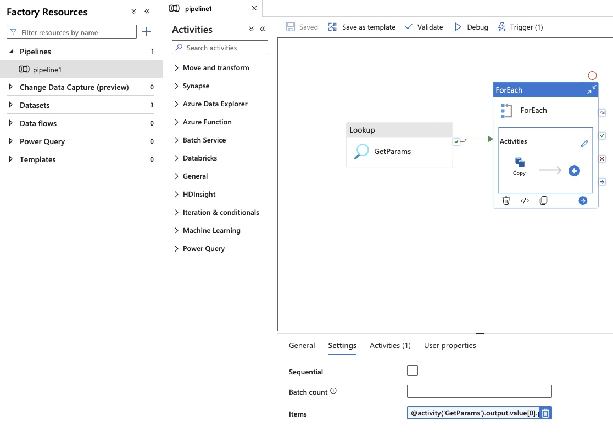
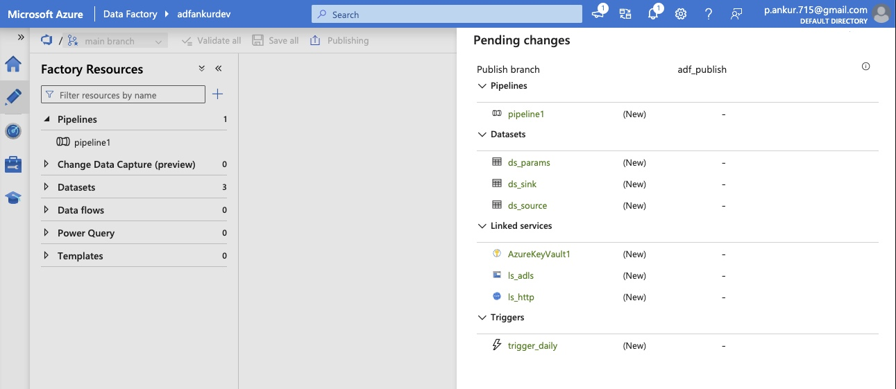
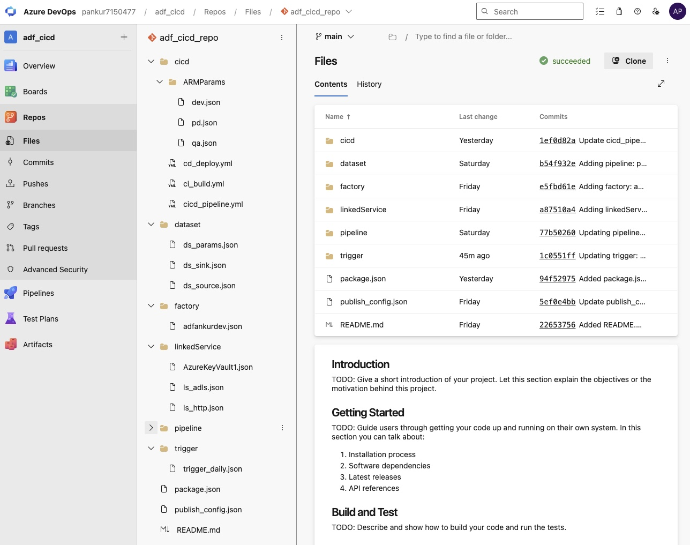
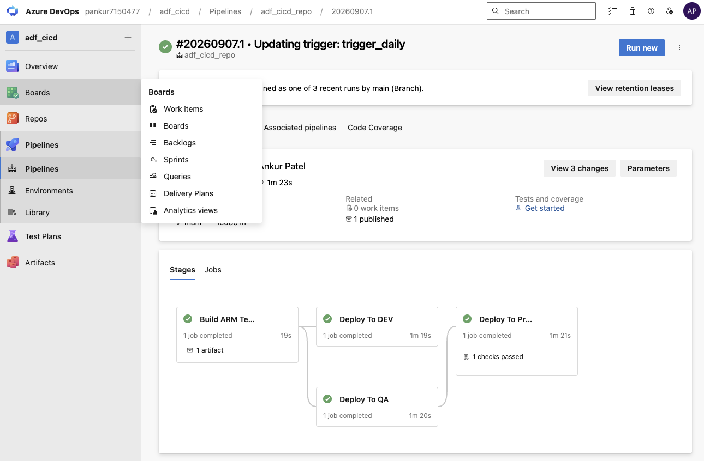
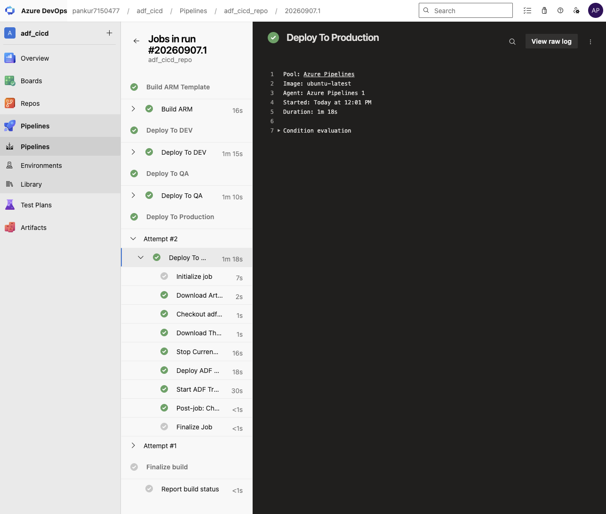

# Azure_CICD

CI/CD pipeline for **Azure Data Factory (ADF)**, built with **Azure DevOps**, ARM templates, and a multi-stage YAML pipeline that promotes ADF resources through **DEV → QA → Production**, with an approval gate in front of Production.

## Architecture


- Developers work in **feature branches** off `main` in the ADF Git-integrated repo (e.g. `feat/rahul`, `feat/sahil`).
- Changes are authored and validated in **ADF Studio**, then merged into `main` and **published**, which generates the ADF `adf_publish` (live mode) branch containing the exported factory JSON.
- An **Azure DevOps YAML pipeline** picks up the `adf_publish` branch content, builds an ARM template, and deploys it across environments using **Azure CLI / Azure PowerShell** tasks, a **Pre/Post-Deployment script**, **Key Vault**, and **Managed Identity** for secrets and auth.

## Repository Structure

```
├── cicd/
│   ├── cicd_pipeline.yml     # Main multi-stage pipeline (Build → Dev → QA → Prod)
│   ├── ci_build.yml          # CI template: npm validate + ARM template export
│   ├── cd_deploy.yml         # CD template: stop triggers → deploy ARM → start triggers
│   └── ARMParams/
│       ├── dev.json          # Per-environment ARM parameters (factory name,
│       ├── qa.json           #   Key Vault, ADLS, and HTTP linked service URLs)
│       └── pd.json
├── dataset/                  # ADF dataset definitions exported from the factory
├── data/                     # Sample source data used by the pipeline (CSV, params)
├── pics/                     # Screenshots referenced in this README
└── package.json              # @microsoft/azure-data-factory-utilities (validate/export)
```

## CI/CD Workflow

**1. Develop in a feature branch**

Build or edit the pipeline in ADF Studio on a feature branch. Below, `pipeline1` uses a `Lookup` to fetch parameters and a `ForEach` to run a `Copy` activity per item.



**2. Merge and publish to the collaboration branch**

Once validated, the feature branch is merged into `main`. Publishing from `main` generates the ADF "live mode" `adf_publish` branch, staging every changed pipeline, dataset, linked service, and trigger as a pending change.



**3. Repo mirrors the published factory**

The Azure Repos Git repo now holds the full exported factory (`factory/`, `dataset/`, `linkedService/`, `pipeline/`, `trigger/`) alongside the `cicd/` pipeline definitions that drive deployment.



**4. CI stage — Build ARM Template** (`ci_build.yml`)

- Installs Node.js and npm dependencies (`@microsoft/azure-data-factory-utilities`)
- Runs `npm run build validate` against the factory
- Runs `npm run build export` to generate the ARM template (`ArmTemplate/`)
- Publishes the ARM template as a pipeline artifact

**5. CD stages — Deploy to DEV → QA → Production** (`cd_deploy.yml`)

Each environment stage:
1. Downloads the ARM template artifact
2. Runs `PrePostDeploymentScript.ps1` to **stop** any currently running ADF triggers
3. Deploys the ARM template via `AzureResourceManagerTemplateDeployment@3`, parameterized per environment (`cicd/ARMParams/<env>.json`)
4. Re-runs `PrePostDeploymentScript.ps1` to **start** the triggers again

Production (`pd`) is defined as an Azure DevOps **Environment** with an approval check, so deployment only proceeds after manual sign-off. Variable groups (`devgroup`, `qagroup`, `prodgroup`) in the Library supply `DataFactory`, `ResourceGroup`, and `SubscriptionId` per stage.

**6. Pipeline run**

All four stages — Build ARM Template, Deploy To DEV, Deploy To QA, Deploy To Production — running end to end:



**7. Deployment job detail**

Drilling into the **Deploy To Production** job shows the individual steps: download artifact, checkout, stop triggers, deploy the ARM template, and restart triggers.



## Environments

| Environment | Data Factory     | Variable group |
|-------------|------------------|----------------|
| Dev         | `adfankurdev`    | `devgroup`     |
| QA          | `adfankurqa`     | `qagroup`      |
| Production  | `adfankurpd`     | `prodgroup`    |

Each `ARMParams/<env>.json` overrides the factory name plus the Key Vault, ADLS, and HTTP linked service endpoints for that environment.

## Tech Stack

- Azure Data Factory (Git-integrated)
- Azure DevOps Pipelines (YAML, multi-stage)
- ARM templates + `@microsoft/azure-data-factory-utilities`
- Azure PowerShell / Azure CLI
- Azure Key Vault, Managed Identity
